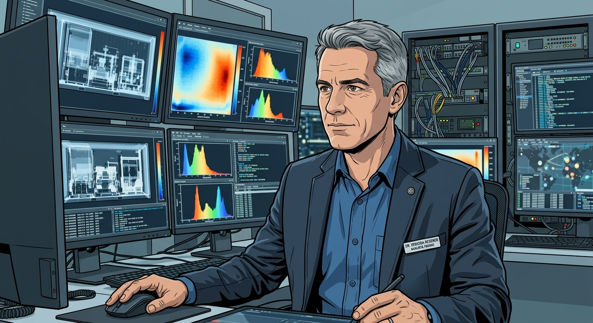
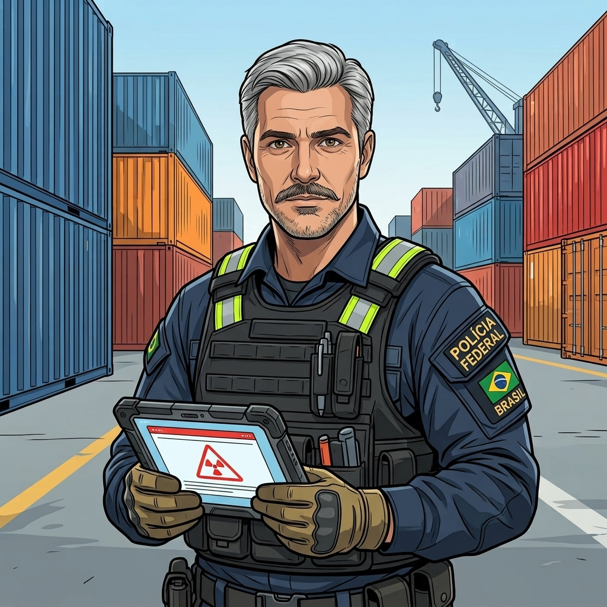
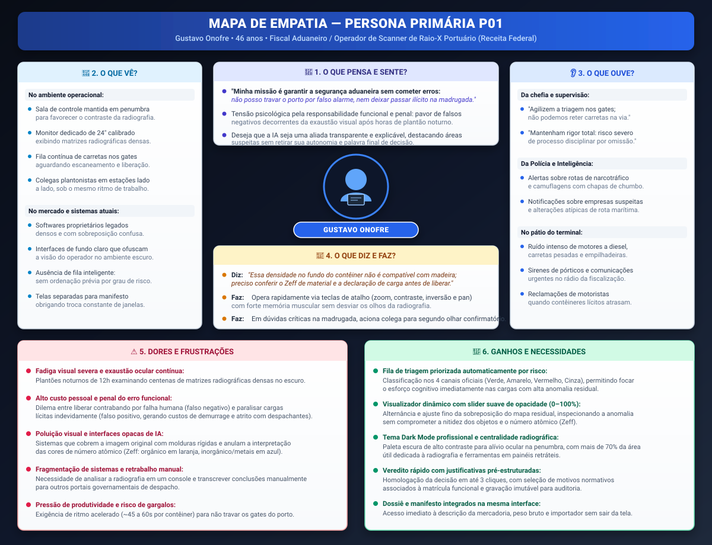

# Entrega 3 — Personas, mapa de empatia, contexto de uso e jornada

**Data:** 04/09/2026  
**Status:** 🟨 em andamento  
**Responsabilidade:** 1 persona por integrante; 1 mapa de empatia, 1 contexto de uso consolidado e 1 jornada por equipe (salvo orientação diferente do docente).

## Objetivo da atividade

Representar grupos de usuários de forma útil para decisões de design. Persona não é personagem decorativo: suas características devem alterar requisitos, prioridades, linguagem, fluxos ou critérios de avaliação.

## Atenção a projetos técnicos

Em TCCs sem interface original, a persona pode representar um **profissional que se apropria da contribuição técnica**: DBA, analista, cientista de dados, administrador, pesquisador, técnico, operador, gestor ou especialista de domínio.

Não escolha um perfil apenas porque “parece combinar” com a tecnologia. Explique **qual objetivo esse perfil teria e qual parte da contribuição do TCC produziria valor para ele**. Se ainda for hipótese, mantenha como hipótese/proto-persona a validar.

Também considere papéis diferentes quando houver tarefas distintas, por exemplo:

- operador que executa análises;
- administrador que configura e gerencia permissões;
- especialista que interpreta resultados;
- gestor que consulta relatórios e decide;
- auditor que revisa histórico.

## Entradas da Entrega 1

Antes de criar personas, retome os tipos de usuários, características relevantes, objetivos e hipóteses registradas na Entrega 1. A persona **não deve transformar uma hipótese inicial em fato por meio de uma história fictícia**.

| Item da Entrega 1 | Status inicial | Evidência disponível agora | Como será tratado nesta entrega |
|---|---|---|---|
| **Perfil: Fiscal Aduaneiro / Operador de Scanner (H01)** | [H01] Hipótese | Confirmado pela análise de mercado (C01 Rapiscan e C03 Smiths) e pelo fluxo de despacho do Siscomex (C02) como o usuário que opera a estação de imagem e decide sobre a conferência. | Incorporar como base da Persona Primária P01 (Gustavo Onofre). |
| **Fadiga visual e exaustão em plantão noturno (H10, H13)** | [H10], [H13] Hipóteses | Situação concreta descrita na Entrega 1 (§4.5) e corroborada pelas especificações de estações de alta rotação da Smiths (C03: monitores de 22"-24" para alívio ocular em tráfego de até 80 caminhões/h). | Incorporar como restrição central e dor prioritária de P01, demandando Dark Mode e ergonomia visual. |
| **Ambiente de sala de controle em recinto alfandegado (H14, H16)** | [H14], [H16] Hipóteses | Especificações da estação RIW (Review Image Workstation) da Smiths e salas de monitoramento portuário. Ambiente com penumbra e ruídos externos. | Incorporar no contexto de uso de P01, descartando soluções com interfaces claras ou alertas puramente sonoros. |
| **Estação de trabalho com monitor dedicado (H15)** | [H15] Hipótese (revisada) | Análise C03 demonstrou uso de monitor dedicado de 22" a 24" calibrado para radiografia (afastando a premissa inicial de múltiplos monitores genéricos). | Incorporar como restrição de hardware para P01, exigindo centralidade da radiografia e painéis retráteis. |
| **Necessidade de comparação visual e explicabilidade (H05, H30, H31, H37)** | [H05], [H30], [H31], [H37] Hipóteses | C01 (InSight Vehicle Compare / High Density) e C03 (viZual Zeff) mostram que operadores dependem de comparação e rejeitam métricas matemáticas abstratas na hora da triagem. | Incorporar como objetivo técnico de P01: mapa residual por transparência (slider) e destaque de ROI. |
| **Registro motivado de veredito e responsabilidade legal (H06, H08, H17, H18, H19)** | [H06], [H08], [H17], [H18], [H19] Hipóteses | Análise C02 comprovou que a decisão aduaneira é um ato formal comunicado (exigência fiscal), motivado e com valor jurídico, vinculado à matrícula do auditor. | Incorporar como requisito de fluxo de P01: veredito com justificativa rápida e registro de auditoria imutável. |
| **Escala de risco com quatro canais aduaneiros (H24 revisada)** | [H24] Revisada na Entrega 2 | Manual de Despacho de Importação da RFB (C02) comprovou que o gerenciamento aduaneiro adota 4 canais: verde, amarelo, vermelho e cinza (fraude). | Incorporar no modelo mental de P01, adaptando a fila de triagem da IA aos quatro canais normativos. |
| **Perfil: Analista de Inteligência Aduaneira (H02)** | [H02] Hipótese | O Siscomex (C02) opera com dossiês históricos e trilhas de auditoria para investigação e acompanhamento de despacho. | A ser incorporado na Persona Secundária P02 (Gabriel Albertini). |
| **Perfil: Especialista de Scanner / Supervisor (H09 revisada, ?03)** | [H09], [?03] Hipóteses | C03 demonstrou o domínio técnico avançado de operadores sobre manipulação de filtros (Zeff, realce de bordas, histograma). | A ser incorporado na Persona Secundária P03 (Alexandre Pierri). |

---

## 1. Personas

### Persona P01 — Gustavo Onofre (Fiscal Aduaneiro / Operador de Scanner)

**Autor(a):** Kawan Mark Geronimo Da Silva — 22.222.010-5  
**Tipo:** primária  
**Base de evidências:** Combinação entre a literatura do TCC (*Self-supervised anomaly detection and localization for x-ray cargo images*, Gaikwad et al., 2024), a análise de soluções de mercado na Entrega 2 (Rapiscan InSight C01 e Smiths Detection RIW C03), a rotina normativa do Siscomex (C02) e a situação concreta de uso H13 registrada na Entrega 1.  
**Hipóteses da Entrega 1 relacionadas:** H01, H04, H05, H06, H07, H08, H10, H13, H14, H15 (revisada), H16, H24 (revisada), H30, H31, H34, H37, H38

| Campo | Descrição |
|---|---|
| **Faixa etária / contexto relevante** | 46 anos. Atua há 12 anos na carreira aduaneira, dos quais 7 dedicados à fiscalização não intrusiva com scanners de contêineres e cargas em grande porto brasileiro. Trabalha em regime de escala de plantão (12x36h), alternando turnos diurnos e noturnos/madrugadas. |
| **Ocupação/papel** | Fiscal Aduaneiro da Receita Federal / Operador de Estação de Análise Radiográfica (RIW). É o usuário direto na linha de frente operacional, responsável por examinar a radiografia de cada contêiner que atravessa o scanner e decidir se a carga segue liberada ou se deve ser retida para conferência física/exigência fiscal. |
| **Conhecimento do domínio** | Altíssimo conhecimento empírico em radioscopia de carga: domina a leitura de densidades de feixe de raio-X, identifica padrões de falsa cor por número atômico ($Z_{eff}$: orgânico em tons quentes, inorgânico em tons frios/metálico), reconhece estruturas típicas de contêineres marítimos (vigas, piso, longarinas) e as táticas habituais de camuflagem de ilícitos (fundos falsos, blindagens de chumbo). Conhece com profundidade a legislação aduaneira brasileira e os canais de parametrização. |
| **Experiência tecnológica** | Média/alta com consoles dedicados de scanner (softwares proprietários Rapiscan AS&E e Smiths CargoVision) e sistemas corporativos do governo (Portal Único Siscomex). Baixa com inteligência artificial: não possui formação em ciência da computação e não se interessa por arquitetura de redes neurais, loss ou métricas estatísticas do modelo; exige que os resultados computacionais sejam traduzidos em apoios visuais operacionais diretamente sobre a imagem. |
| **Objetivos** | 1. Triar com máxima agilidade a fila contínua de contêineres do terminal sem provocar filas de carretas nos gates ou gargalos logísticos portuários. 2. Detectar com precisão anomalias estruturais e cargas ilícitas não declaradas camufladas no interior do contêiner. 3. Emitir decisões com respaldo legal sólido e rastreabilidade formal, fundamentando retenções de forma inequívoca. |
| **Necessidades** | 1. Fila de trabalho priorizada automaticamente pelo grau de anomalia detectado pela IA (ordenada pelos canais normativos, destacando cargas suspeitas). 2. Destaque visual imediato das regiões de interesse (ROI) e do mapa de anomalia residual sem mascarar a imagem original e sem anular a discriminação de materiais ($Z_{eff}$). 3. Ferramenta de comparação visual flexível (slider de opacidade ou lado a lado) para entender exatamente onde a IA enxergou discrepância. 4. Consulta integrada aos dados do manifesto de carga (descrição da mercadoria, peso, importador) na mesma interface para validar a coerência da imagem sem alternar de aplicativo. 5. Fluxo de registro de veredito em poucos passos, com justificativas pré-formatadas associadas automaticamente à sua credencial funcional. |
| **Dores/frustrações** | 1. Severa fadiga visual e exaustão mental acumulada após inspecionar centenas de radiografias complexas por turno, agravada nos plantões de madrugada (situação H13). 2. Tensão psicológica constante pela responsabilidade pessoal: pavor de liberar por engano uma carga com drogas/armas (falso negativo) e responder a sindicâncias ou processos administrativos. 3. Desgaste ao paralisar contêineres lícitos por falsos alarmes (falsos positivos), gerando atritos com despachantes e operadores do terminal portuário. 4. Fragmentação de sistemas: ter que inspecionar a imagem em um console proprietário e lançar a decisão manualmente em outro sistema governamental. |
| **Motivadores** | 1. Cumprir a meta operacional do turno com 100% de precisão e segurança jurídica. 2. Eficácia e prestígio profissional na interceptação de contrabando relevante de alto valor ou ameaças à segurança nacional. 3. Redução do estresse diário através de ferramentas de auxílio que façam o "trabalho pesado" de varredura prévia sem tirar dele a palavra final. |
| **Restrições/acessibilidade** | 1. Cansaço ocular recorrente e início de presbiopia (necessita de tipografia limpa com contraste adequado, ícones reconhecíveis e paleta visual que não ofusque). 2. Proibição de dependência exclusiva de cor (atendendo à recomendação RC11 da Entrega 2: o status de canal e o nível de anomalia devem apresentar texto explicativo redundante e ícones, não apenas semáforo cromático). 3. Ambiente em meia-luz (penumbra de sala de comando), tornando interfaces de fundo branco inaplicáveis por causarem ofuscamento e cansaço visual. |
| **Ambiente típico de uso** | Sala de controle e triagem de raio-X instalada em recinto alfandegado de terminal portuário; estação de trabalho desktop com monitor dedicado de alta fidelidade visual (22" a 24"); penumbra ambiente contínua; ruídos de maquinário e caminhões no pátio externo; interrupções ocasionais por rádio comunicador da fiscalização. |
| **Comportamentos relevantes** | Tem forte memória muscular no uso de teclas de atalho (zoom, contraste, pan) e teclado numérico; irrita-se profundamente quando um software demora para carregar ou congela a imagem; ao notar uma suspeita complexa, costuma chamar um fiscal colega para um segundo olhar confirmatório antes de lavrar o termo de retenção. |

**Decisões de design influenciadas por P01:**

- **Tema Dark Mode obrigatório:** Interface construída com paleta escura profissional de alto contraste, desenhada especificamente para salas de controle com pouca luz ambiente, minimizando a fadiga visual do plantonista (H10, H13, H16).
- **Centralidade absoluta da radiografia (RC10):** A imagem de raio-X deve ocupar mais de 70% da área útil do monitor de 24", mantendo metadados da carga (manifesto) e botões de ação em painéis laterais retraíveis para não desviar a atenção visual principal (H15).
- **Camada de anomalia com slider de opacidade e toggle rápido (RC09):** O mapa de calor residual da IA deve ser exibido como uma sobreposição ajustável (de 0% a 100%) via atalho de teclado ou controle deslizante suave, permitindo que Gustavo inspecione a anomalia sem perder a visão das cores falsas de número atômico ($Z_{eff}$) e do contorno dos objetos.
- **Fila de trabalho priorizada automaticamente por risco (RC05, RC06):** A tela inicial do sistema deve organizar os contêineres escaneados por ordem de criticidade de anomalia residual da IA, correlacionados aos quatro canais normativos (com destaque imediato para canal cinza - fraude e canal vermelho - conferência física), suprindo a maior deficiência dos softwares concorrentes.
- **Sinalização acessível redundante (RC11):** Toda classificação de risco e severidade de alerta deve conter texto explícito (ex.: `[CANAL VERMELHO — RISCO ELEVADO]`) acompanhado de ícones de advertência, sem confiar unicamente na distinção entre tons de verde, amarelo e vermelho.
- **Fluxo de veredito rápido com justificativas pré-estruturadas (RC04, RC07):** A homologação da decisão deve exigir poucos cliques (ex.: tecla de atalho + seleção de motivo em menu rápido: "discrepância de densidade em relação ao manifesto" / "indício de compartimento oculto"), vinculando automaticamente a matrícula de Gustavo e o timestamp para fins de conformidade legal (H17, H18).

---

### Persona P02 — Dr. Eduardo Resende (Perito / Especialista em Análise Radiográfica)

**Autor(a):** Gabriel Albertini Pinheiro  
**Tipo:** primária  
**Base de evidências:** Estruturada a partir da literatura de detecção profunda e reconstrução espectral em raio-X de carga, das diretrizes de auditoria aduaneira de alta complexidade do Siscomex (C02), da necessidade de laudos periciais fundamentados (RC07, RC08) e dos cenários operacionais de escalonamento de suspeitas (H08, H12, H14, H18, H30).  
**Hipóteses da Entrega 1 relacionadas:** H02, H05, H08, H11, H12, H14, H18, H20, H30, H35, H38

| Campo | Descrição |
|---|---|
| **Faixa etária / contexto relevante** | 52 anos. Perito criminal e analista sênior de imagens radiográficas com 20 anos de experiência em perícia aduaneira e física aplicada à radiologia de segurança. Atua no Centro de Inteligência e Análise de Imagem de 2ª Linha, atendendo remotamente múltiplos terminais portuários. |
| **Ocupação/papel** | Perito / Especialista em Análise Radiográfica de 2ª Linha. É o usuário especialista primário acionado quando o operador de triagem (P01) escala uma imagem duvidosa ou quando o sistema de IA aponta um padrão de alta sofisticação (ex.: blindagem de chumbo, densidade composta ou camuflagem estrutural). É responsável por emitir o laudo técnico pericial definitivo que autoriza a violação de lacre e ação policial de campo (P03). |
| **Conhecimento do domínio** | Científico e altíssimo. Domina a física da radiação, atenuação espectral, coeficientes de absorção de raio-X de alta energia (6–9 MeV), identificação de isótopos/metais pesados e morfologia de contêineres. Sabe diferenciar falhas de calibração do detector de artefatos de camuflagem intencional. |
| **Experiência tecnológica** | Altíssima em softwares analíticos avançados de processamento de imagem, estações DICOM/PACS, histogramas digitais e visualização 3D/Tomografia de Carga. Média/Alta em inteligência artificial: compreende o funcionamento dos mapas de atenção (Grad-CAM), limiares de confiança estatística e reconstrução residual do modelo. |
| **Objetivos** | 1. Diagnosticar com precisão pericial anomalias hiper-camufladas que passam despercebidas na triagem rápida de 1ª linha. 2. Reduzir drasticamente falsos positivos de alto impacto que paralisam operações de grandes exportadores/importadores. 3. Gerar laudos periciais detalhados, instruídos com evidências visuais e métricas de densidade para respaldar inquéritos policiais e processos judiciais. |
| **Necessidades** | 1. Conjunto completo de ferramentas de manipulação espectral (ajuste fino de $Z_{eff}$, equalização de histograma local, inversão de frequência e isolamento de banda de densidade). 2. Comparador de imagens dinâmico lado a lado (imagem atual vs. banco de dados histórico do mesmo contêiner ou tipo de carga). 3. Exibição das métricas de incerteza da IA (Score de Confiança e mapa de calor de reconstrução residual) com detalhamento numérico e vetorial. 4. Módulo de anotação técnica na imagem para demarcação de vetor de invasão, cálculo de volume suspeito e exportação direta para laudo em PDF. |
| **Dores/frustrações** | 1. Receber casos escalados sem contextualização prévia dos dados de manifesto ou com imagens comprimidas que perdem resolução radiográfica. 2. Sistemas que "escondem" os dados brutos da IA, entregando apenas caixas delimitadoras simples sem explicar a assinatura espectral detectada. 3. Perda de tempo preenchendo relatórios periciais burocráticos em editores de texto externos. |
| **Motivadores** | 1. Desvendar esquemas complexos de crime organizado e narcotráfico internacional que utilizam engenharia de camuflagem avançada. 2. Rigor científico e precisão técnica absoluta em suas emissões de laudo. |
| **Restrições/acessibilidade** | 1. Necessidade de monitores de grau médico de altíssima resolução e contraste (mínimo de 4K com calibração de escala de cinza DICOM). 2. Exige controle total de sobreposição (UI não pode poluir a imagem nem aplicar filtros destrutivos irreversíveis na matriz radiográfica). |
| **Ambiente típico de uso** | Sala de Inteligência e Perícia Centralizada; ambiente climatizado, silencioso, com iluminação pericial controlada (penumbra); estação de trabalho de altíssimo desempenho com múltiplos monitores de alta fidelidade visual. |
| **Comportamentos relevantes** | Dedica de 3 a 10 minutos investigando cada caso escalado; aplica rotineiramente múltiplos filtros combinados antes de fechar o diagnóstico; não confia cegamente no veredito automatizado da IA sem antes verificar a assinatura física da matéria na imagem radiográfica. |

**Decisões de design influenciadas por P02:**

- **Painel de Ferramentas Periciais Avançadas (Modo Inspeção Profunda):** Disponibilização de um modo de análise avançada acessível via atalho dedicado, ativando equalização de histograma por região (CLAHE), isolamento de número atômico ($Z_{eff}$) por janela de densidade e medição de volume em pixels radiográficos (H08, H11, H14).
- **Módulo de Comparação Histórica Lado a Lado (RC10):** Permite que Eduardo abra simultaneamente no mesmo plano de visão o escaneamento atual e imagens radiográficas anteriores da mesma declaração/manifesto para identificar alterações estruturais ou padrões de fraude recorrentes (H02, H30).
- **Inspeção de Incerteza e Resíduo da IA (RC09):** Painel expansível que expõe não apenas o mapa de calor, mas o *score* estatístico de divergência da matriz de densidade, permitindo que o perito valide numericamente o peso da indicação algorítmica (H05, H12).
- **Gerador Automático de Laudo Pericial com Anotações (RC07, RC08):** Ferramenta de anotação integrada à imagem que exporta a região demarcada com as métricas da IA e considerações técnicas diretamente para um modelo de termo de retenção fundamentado, eliminando a necessidade de redigir laudos em softwares externos (H18, H20, H35).
---

### Persona Secundária P03 — Marcos Oliveira / Agente de Segurança Pública (Operacional de Campo)

**Tipo:** secundária  
**Base de evidências:** Estruturada a partir dos requisitos formais de interceptação aduaneira e policial no ambiente portuário, pelas regras normativas de exigência/conferência física do Siscomex (C02), pelas hipóteses de uso operacional de campo (H03, H16, H17, H19, H24) e pela necessidade de consumo simplificado do resultado da IA sem complexidade de análise radiográfica.  
**Hipóteses da Entrega 1 relacionadas:** H03, H06, H08, H12, H14, H16, H17, H18, H19, H24 (revisada)

| Campo | Descrição |
|---|---|
| **Nome** | Marcos Oliveira (Capitão Oliveira) |
| **Faixa etária / contexto relevante** | 38 anos. Agente de segurança/policial atuante na fiscalização de campo e repressão ao contrabando em recinto alfandegado portuário há 8 anos. Atua em patrulha externa, pátios de contêineres e vistorias físicas diretas no *gate* ou terminal. |
| **Ocupação/papel** | Agente de Segurança Pública / Policial de Campo. É o usuário secundário e destinatário da decisão de triagem: não opera o console de raio-X nem analisa a imagem bruta, mas **consome o veredito simplificado de anomalia** para realizar a abordagem, retenção física, escolta do caminhão ou abertura do lacre do contêiner para verificação. |
| **Conhecimento do domínio** | Elevado conhecimento em táticas de abordagem, procedimentos de apreensão, conferência física de carga, legislação penal e cadeia de custódia de provas. **Baixo/Nulo conhecimento em física de radiologia ou interpretação de raio-X**: não sabe ler mapas residuais, números atômicos ($Z_{eff}$) ou densidades radiográficas, dependendo exclusivamente de um indicador binário/classificatório claro e objetivo (Existe anomalia? Qual a localização aproximada no contêiner?). |
| **Experiência tecnológica** | Média em dispositivos móveis (tablets e coletores robustecidos de pátio) e rádios comunicadores; baixa em softwares analíticos complexos. Exige dados diretos, legíveis sob luz solar e que requeiram o mínimo de toques na tela. |
| **Objetivos** | 1. Receber alertas imediatos e sem ambiguidade de cargas críticas/anômalas direcionadas para interceptação física. 2. Localizar e abordar o caminhão/contêiner no pátio antes da sua saída do recinto alfandegado. 3. Ter suporte visual direto (localização da anomalia) para abrir a porta do contêiner e ir diretamente ao ponto suspeito durante a busca física. |
| **Necessidades** | 1. Status claro e binário da anomalia (`[ANOMALIA DETECTADA — CANAL CINZA/VERMELHO]` vs `[NENHUMA ANOMALIA DETECTADA]`). 2. Indicador visual simplificado da posição no contêiner (ex.: "Setor Traseiro / Lado Esquerdo") para direcionar o esforço da vistoria física. 3. Notificações/alertas push instantâneos sobre contêineres que exigem retenção imediata. 4. Botão de confirmação de ação de campo rápida ("Abordagem Efetuada" / "Encaminhado para Vistoria Física"). |
| **Dores/frustrações** | 1. Receber relatórios visuais poluídos com gráficos de IA ou imagens de raio-X complexas que ele não consegue/não tem tempo de interpretar no pátio. 2. Perder tempo procurando mercadorias ilícitas no meio de toneladas de carga por falta de indicação exata de onde a anomalia foi localizada. 3. Falhas de comunicação ou atrasos no recebimento da ordem de retenção que permitam que o caminhão saia do terminal portuário. |
| **Motivadores** | 1. Efetuar a apreensão de ilícitos (drogas, armas, contrabando) com precisão e segurança para a equipe. 2. Agilidade no procedimento de liberação de pátio para não paralisar o tráfego de carretas. |
| **Restrições/acessibilidade** | 1. Operação em ambiente aberto sob alta iluminação solar e chuva (exige alto contraste visual em telas móveis/tablets). 2. Uso de luvas táticas e equipamento de proteção individual (EPI), exigindo botões amplos e alvos de toque grandes. 3. Impossibilidade de ler textos longos durante ações de abordagem física. |
| **Ambiente típico de uso** | Pátio aberto de contêineres, *gates* de saída de terminais portuários e galpões de conferência física; sob ruído forte de carretas e empilhadeiras; movimentado e exposto às intempéries do tempo. |
| **Comportamentos relevantes** | Toma decisões operacionais imediatas baseadas em comandos diretos; consulta o tablet/dispositivo móvel rapidamente com uma só mão antes ou durante a abordagem; depende da autorização/laudo do fiscal aduaneiro (Persona P01) para violar o lacre. |

---

### Decisões de design influenciadas pela Persona Secundária P03 (Marcos):

* **Cartão de Veredito Simplificado (Avisos de Campo):** Para perfis de segurança/policiais, o sistema deve fornecer uma visualização simplificada/exportável contendo apenas o número do contêiner, placa do veículo, o status formal do canal (ex.: `[CANAL CINZA — RETENÇÃO IMEDIATA]`) e a presença ou ausência de anomalia, sem expor o visualizador completo de raio-X.
* **Mapeamento de Zona/Quadrante no Contêiner:** A anomalia deve ser traduzida em uma localização textual/esquemática simples (ex.: "Quadrante 3 — Fundo do Contêiner, Lado Direito") para guiar a busca física no pátio sem exigir que o policial interprete a imagem radiográfica.
* **Ações de Confirmação em 1-Toque:** Botoeira simplificada para registro de status de campo (`[CONFIRMAR RETENÇÃO]` / `[INICIAR VISTORIA FÍSICA]`), garantindo a rastreabilidade e a sincronização do evento com o histórico do Siscomex (RC07, RC08[cite: 12]).

---

### Síntese das personas

*(A síntese comparativa das personas será consolidada pela equipe após a inclusão das personas P02 e P03 pelos demais integrantes.)*

---

## 2. Mapa de empatia — equipe

**Persona escolhida:** Persona P01 — Gustavo Onofre  
**Justificativa:** É a persona primária do projeto, representando o operador direto que toma a decisão crítica de triagem e veredito na estação de imagem sob condições severas de fadiga visual e pressão de tempo.

*(Seção a ser consolidada em conjunto pela equipe a partir das vivências e decisões de P01.)*

| Dimensão | Conteúdo | Status/evidência |
|---|---|---|
| **O que vê?** | {{...}} | {{...}} |
| **O que ouve?** | {{...}} | {{...}} |
| **O que diz e faz?** | {{...}} | {{...}} |
| **O que pensa e sente?** | {{...}} | {{...}} |
| **Dores** | {{...}} | {{...}} |
| **Ganhos** | {{...}} | {{...}} |

---

## 3. Contexto de uso — consolidação

*(Seção a ser consolidada em conjunto pela equipe.)*

| Dimensão | Descrição | Implicação de design |
|---|---|---|
| **Usuários** | {{...}} | {{...}} |
| **Tarefas** | {{...}} | {{...}} |
| **Equipamentos** | {{...}} | {{...}} |
| **Ambiente físico** | {{...}} | {{...}} |
| **Ambiente social/organizacional** | {{...}} | {{...}} |
| **Papéis/permissões/governança** | {{...}} | {{...}} |
| **Volume de dados/histórico** | {{...}} | {{...}} |

---

## 4. Jornada do usuário — equipe

**Persona:** Persona P01 — Gustavo Onofre  
**Objetivo da jornada:** Triar contêineres na fila de varredura, inspecionar suspeitas de anomalia residual com auxílio da IA e emitir veredito motivado com segurança operacional.  
**Início e fim da jornada:** Inicia na assunção do posto de trabalho na sala de raio-X e encerra no despacho do lote de contêineres com registro formal no sistema.

*(Seção a ser consolidada em conjunto pela equipe.)*

| Etapa | Situação/ação | Objetivo | Pensamento/emoção | Dor | Oportunidade de design | Evidência |
|---|---|---|---|---|---|---|
| 1 | {{...}} | {{...}} | {{...}} | {{...}} | {{...}} | {{...}} |

---

## Síntese

Quais necessidades e objetivos devem obrigatoriamente aparecer nos cenários e nas tarefas seguintes?

*(A ser preenchido pela equipe na consolidação final da entrega.)*

---

## Checklist

- [x] Existe pelo menos uma persona por integrante (P01 desenvolvida; P02 e P03 estruturadas para os respectivos autores).
- [ ] As personas não são apenas diferenças demográficas superficiais (aguardando P02 e P03).
- [x] Está claro o que é dado real e o que é hipótese/proto-persona.
- [x] A persona não “validou por ficção” uma hipótese da Entrega 1; afirmações continuam marcadas como hipótese quando não há evidência.
- [x] Objetivos e dores têm consequência para o design.
- [x] Contexto de uso está coerente com a Entrega 1 e com a análise de concorrência da Entrega 2.
- [x] Em TCC sem interface original, a persona possui relação explícita com a contribuição técnica (modelo de anomalia residual em raio-X).
- [x] Papéis administrativos, técnicos e decisórios só foram criados quando possuem objetivos/tarefas diferentes.
- [ ] Jornada possui etapas, dores e oportunidades e não é apenas wireflow (aguardando consolidação).
- [x] IDs das personas foram mapeados para a rastreabilidade.
