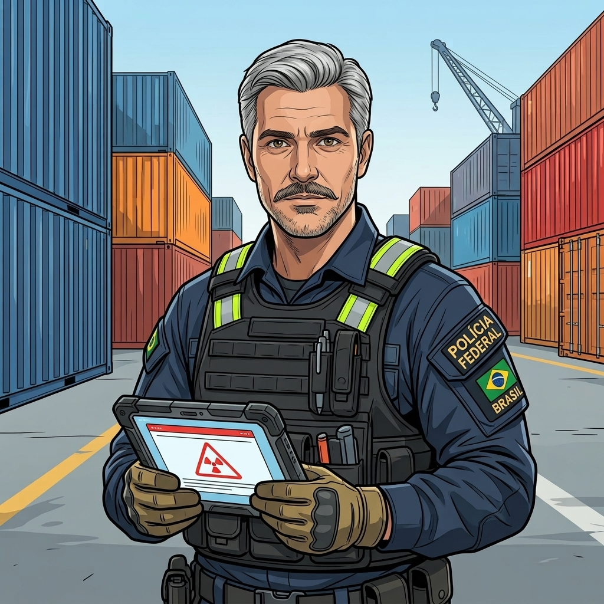
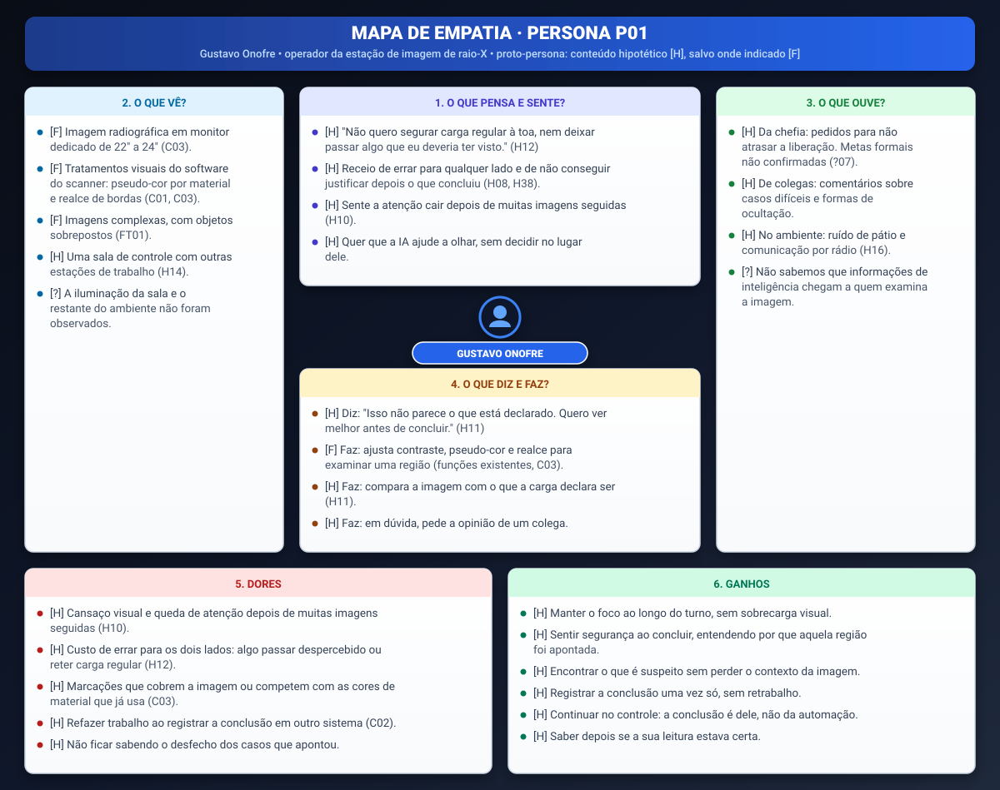

# Entrega 3 — Personas, mapa de empatia, contexto de uso e jornada

**Data:** 04/09/2026  
**Status:** 🟩 concluída  
**Responsabilidade:** 1 persona por integrante; 1 mapa de empatia, 1 contexto de uso consolidado e 1 jornada por equipe (salvo orientação diferente do docente).

## Objetivo da atividade

Representar grupos de usuários de forma útil para decisões de design. Persona não é personagem decorativo: suas características devem alterar requisitos, prioridades, linguagem, fluxos ou critérios de avaliação.

## Atenção a projetos técnicos

Em TCCs sem interface original, a persona pode representar um **profissional que se apropria da contribuição técnica**: DBA, analista, cientista de dados, administrador, pesquisador, técnico, operador, gestor ou especialista de domínio.

Não escolha um perfil apenas porque “parece combinar” com a tecnologia. Explique **qual objetivo esse perfil teria e qual parte da contribuição do TCC produziria valor para ele**. Se ainda for hipótese, mantenha como hipótese/proto-persona a validar.

Também considere papéis diferentes quando houver tarefas distintas, por exemplo:

- operador que executa análises;
- administrador que configura e gerencia permissões;
- especialista que interpreta resultados;
- gestor que consulta relatórios e decide;
- auditor que revisa histórico.

## Entradas da Entrega 1

Antes de criar personas, retome os tipos de usuários, características relevantes, objetivos e hipóteses registradas na Entrega 1. A persona **não deve transformar uma hipótese inicial em fato por meio de uma história fictícia**.

| Item da Entrega 1 | Status inicial | Evidência disponível agora | Como será tratado nesta entrega |
|---|---|---|---|
| **Perfil: operador da estação de imagem (H01)** | [H01] Hipótese reformulada | [F] C01 e C03 mostram que os produtos de mercado têm uma estação operada por alguém que examina a imagem. Não mostram quem é essa pessoa no Brasil nem se ela decide sobre a carga. | Base de P01 como proto-persona. A autoridade para liberar ou reter não é atribuída a P01: depende de H39. |
| **Divisão entre quem examina a imagem e quem decide (H39)** | [H39] Hipótese aberta | [F] C02: o despacho tem distribuição para auditor e exigência fiscal, e o Manual de Despacho atribui o desembaraço ao Auditor-Fiscal. Isso não mostra quem opera a estação, quem produz o apontamento nem como ele chega ao auditor. | Base de P02 como proto-persona. A fronteira entre P01 e P02 é a primeira questão da Entrega 7. |
| **Fadiga visual e plantão noturno (H10, H13)** | [H10], [H13] Hipóteses | [F] C03: o fabricante justifica monitores de 22" a 24" pela redução de fadiga ocular. É texto de fabricante, não observação de usuários. H13 é cenário exploratório da Entrega 1. | Dor hipotética de P01. Não fundamenta, por si, tema escuro nem outra solução. |
| **Sala de controle em recinto alfandegado (H14, H16)** | [H14] parcialmente sustentada, [H16] aberta | [F] C03: estação dedicada em sistema de alto tráfego. Iluminação, penumbra e ruído não têm evidência. | Entram no contexto de uso como hipótese e lacuna. |
| **Estação com monitor dedicado (H15)** | [H15] parcialmente sustentada | [F] C03: monitor dedicado de 22" a 24". Não há evidência de múltiplos monitores. | Restrição plausível para P01. Não define proporção de tela nem painéis. |
| **Comparação visual e explicação (H05, H30, H31, H37)** | Hipóteses parcialmente sustentadas | [F] C01 mostra comparação entre imagens e destaque de regiões. C03 mostra pseudo-cor por material. Nenhuma mostra a preferência dos operadores nem rejeição a métricas numéricas. | Necessidade de P01: entender onde a IA apontou discrepância. A forma (lado a lado, sobreposição, opacidade) é alternativa a testar. |
| **Registro motivado e responsabilidade (H06, H08, H17, H18, H19)** | [H18] sustentada documentalmente; as demais abertas ou parciais | [F] C02: a decisão aduaneira é um ato formal, com motivo e prazo, vinculado a um auditor responsável. | Necessidade de P02. Quem registra o quê depende de H39. |
| **Quatro canais aduaneiros (H24 revisada)** | [H24] Revisada na Entrega 2 | [F] C02: verde, amarelo, vermelho e cinza são classificação normativa do despacho, com critérios fiscais e documentais. | Entra como vocabulário que P01 e P02 conhecem. Não é usada para representar o resultado da IA (RC05, ?08). |
| **Perfil: Analista de Inteligência Aduaneira (H02)** | [H02] Hipótese aberta | Sem evidência nova. | Não vira persona nesta entrega. |
| **Perfil: agente de campo (H03, H42)** | [H03] aberta; [H42] nova | [F] C02: o canal vermelho prevê verificação física da mercadoria. Não há evidência de que quem a executa use a solução. A Entrega 1 (H03) supunha que não usaria. | P03 fica como proto-persona a validar, possível stakeholder. |

---

## 1. Personas

### Classificação do elenco

A classificação segue o papel de cada persona no design, e não a frequência de uso. Persona primária é a que precisa de uma interface própria, porque não seria bem atendida pela interface desenhada para outra.

| Persona | Classificação | Justificativa |
|---|---|---|
| P01, Gustavo Onofre | primária | [H01] Examina a imagem radiográfica, que é onde a contribuição do TCC atua. A interface de análise é desenhada para ela. |
| P02, Dr. Eduardo Resende | primária | [F] O Auditor-Fiscal é o responsável pelo desembaraço, e o despacho tem distribuição para auditor e exigência fiscal (C02 da Entrega 2). [H39] Se a decisão formal couber a ele, precisa de um fluxo próprio, de conferir a evidência com a declaração e formalizar o ato, que a interface de análise de P01 não atende. |
| P03, Marcos Oliveira | proto-persona a validar | [H42] Não está demonstrado que o agente de campo interage com a solução. Ele pode receber a ordem por outro sistema, verbalmente ou por documento, pertencer a outro órgão ou não precisar de interface nova. Até H42 ser investigada, P03 é tratado como possível stakeholder do fluxo, fica fora do recorte principal e não justifica uma interface móvel. |

[H39] Se a investigação mostrar que P01 e P02 são a mesma pessoa ou funções da mesma carreira, as duas personas serão fundidas ou redefinidas.

### Persona P01 — Gustavo Onofre (Fiscal Aduaneiro / Operador de Scanner)

**Autor(a):** Kawan Mark Geronimo Da Silva — 22.222.010-5  
**Tipo:** primária  
**Base de evidências:** Combinação entre a literatura do TCC (*Self-supervised anomaly detection and localization for x-ray cargo images*, Gaikwad et al., 2024), a análise de soluções de mercado na Entrega 2 (Rapiscan InSight C01 e Smiths Detection RIW C03), a rotina normativa do Siscomex (C02) e a situação concreta de uso H13 registrada na Entrega 1.  
**Hipóteses da Entrega 1 relacionadas:** H01, H04, H05, H06, H07, H08, H10, H13, H14, H15 (revisada), H16, H24 (revisada), H30, H31, H34, H37, H38

| Campo | Descrição |
|---|---|
| **Faixa etária / contexto relevante** | 46 anos. Atua há 12 anos na carreira aduaneira, dos quais 7 dedicados à fiscalização não intrusiva com scanners de contêineres e cargas em grande porto brasileiro. Trabalha em regime de escala de plantão (12x36h), alternando turnos diurnos e noturnos/madrugadas. |
| **Ocupação/papel** | Fiscal Aduaneiro da Receita Federal / Operador de Estação de Análise Radiográfica (RIW). É o usuário direto na linha de frente operacional, responsável por examinar a radiografia de cada contêiner que atravessa o scanner e decidir se a carga segue liberada ou se deve ser retida para conferência física/exigência fiscal. |
| **Conhecimento do domínio** | Altíssimo conhecimento empírico em radioscopia de carga: domina a leitura de densidades de feixe de raio-X, identifica padrões de falsa cor por número atômico ($Z_{eff}$: orgânico em tons quentes, inorgânico em tons frios/metálico), reconhece estruturas típicas de contêineres marítimos (vigas, piso, longarinas) e as táticas habituais de camuflagem de ilícitos (fundos falsos, blindagens de chumbo). Conhece com profundidade a legislação aduaneira brasileira e os canais de parametrização. |
| **Experiência tecnológica** | Média/alta com consoles dedicados de scanner (softwares proprietários Rapiscan AS&E e Smiths CargoVision) e sistemas corporativos do governo (Portal Único Siscomex). Baixa com inteligência artificial: não possui formação em ciência da computação e não se interessa por arquitetura de redes neurais, loss ou métricas estatísticas do modelo; exige que os resultados computacionais sejam traduzidos em apoios visuais operacionais diretamente sobre a imagem. |
| **Objetivos** | 1. Triar com máxima agilidade a fila contínua de contêineres do terminal sem provocar filas de carretas nos gates ou gargalos logísticos portuários. 2. Detectar com precisão anomalias estruturais e cargas ilícitas não declaradas camufladas no interior do contêiner. 3. Emitir decisões com respaldo legal sólido e rastreabilidade formal, fundamentando retenções de forma inequívoca. |
| **Necessidades** | 1. Fila de trabalho priorizada automaticamente pelo grau de anomalia detectado pela IA (ordenada pelos canais normativos, destacando cargas suspeitas). 2. Destaque visual imediato das regiões de interesse (ROI) e do mapa de anomalia residual sem mascarar a imagem original e sem anular a discriminação de materiais ($Z_{eff}$). 3. Ferramenta de comparação visual flexível (slider de opacidade ou lado a lado) para entender exatamente onde a IA enxergou discrepância. 4. Consulta integrada aos dados do manifesto de carga (descrição da mercadoria, peso, importador) na mesma interface para validar a coerência da imagem sem alternar de aplicativo. 5. Fluxo de registro de veredito em poucos passos, com justificativas pré-formatadas associadas automaticamente à sua credencial funcional. |
| **Dores/frustrações** | 1. Severa fadiga visual e exaustão mental acumulada após inspecionar centenas de radiografias complexas por turno, agravada nos plantões de madrugada (situação H13). 2. Tensão psicológica constante pela responsabilidade pessoal: pavor de liberar por engano uma carga com drogas/armas (falso negativo) e responder a sindicâncias ou processos administrativos. 3. Desgaste ao paralisar contêineres lícitos por falsos alarmes (falsos positivos), gerando atritos com despachantes e operadores do terminal portuário. 4. Fragmentação de sistemas: ter que inspecionar a imagem em um console proprietário e lançar a decisão manualmente em outro sistema governamental. |
| **Motivadores** | 1. Cumprir a meta operacional do turno com 100% de precisão e segurança jurídica. 2. Eficácia e prestígio profissional na interceptação de contrabando relevante de alto valor ou ameaças à segurança nacional. 3. Redução do estresse diário através de ferramentas de auxílio que façam o "trabalho pesado" de varredura prévia sem tirar dele a palavra final. |
| **Restrições/acessibilidade** | 1. Cansaço ocular recorrente e início de presbiopia (necessita de tipografia limpa com contraste adequado, ícones reconhecíveis e paleta visual que não ofusque). 2. Proibição de dependência exclusiva de cor (atendendo à recomendação RC11 da Entrega 2: o status de canal e o nível de anomalia devem apresentar texto explicativo redundante e ícones, não apenas semáforo cromático). 3. Ambiente em meia-luz (penumbra de sala de comando), tornando interfaces de fundo branco inaplicáveis por causarem ofuscamento e cansaço visual. |
| **Ambiente típico de uso** | Sala de controle e triagem de raio-X instalada em recinto alfandegado de terminal portuário; estação de trabalho desktop com monitor dedicado de alta fidelidade visual (22" a 24"); penumbra ambiente contínua; ruídos de maquinário e caminhões no pátio externo; interrupções ocasionais por rádio comunicador da fiscalização. |
| **Comportamentos relevantes** | Tem forte memória muscular no uso de teclas de atalho (zoom, contraste, pan) e teclado numérico; irrita-se profundamente quando um software demora para carregar ou congela a imagem; ao notar uma suspeita complexa, costuma chamar um fiscal colega para um segundo olhar confirmatório antes de lavrar o termo de retenção. |

**Decisões de design influenciadas por P01:**

- **Tema Dark Mode obrigatório:** Interface construída com paleta escura profissional de alto contraste, desenhada especificamente para salas de controle com pouca luz ambiente, minimizando a fadiga visual do plantonista (H10, H13, H16).
- **Centralidade absoluta da radiografia (RC10):** A imagem de raio-X deve ocupar mais de 70% da área útil do monitor de 24", mantendo metadados da carga (manifesto) e botões de ação em painéis laterais retraíveis para não desviar a atenção visual principal (H15).
- **Camada de anomalia com slider de opacidade e toggle rápido (RC09):** O mapa de calor residual da IA deve ser exibido como uma sobreposição ajustável (de 0% a 100%) via atalho de teclado ou controle deslizante suave, permitindo que Gustavo inspecione a anomalia sem perder a visão das cores falsas de número atômico ($Z_{eff}$) e do contorno dos objetos.
- **Fila de trabalho priorizada automaticamente por risco (RC05, RC06):** A tela inicial do sistema deve organizar os contêineres escaneados por ordem de criticidade de anomalia residual da IA, correlacionados aos quatro canais normativos (com destaque imediato para canal cinza - fraude e canal vermelho - conferência física), suprindo a maior deficiência dos softwares concorrentes.
- **Sinalização acessível redundante (RC11):** Toda classificação de risco e severidade de alerta deve conter texto explícito (ex.: `[CANAL VERMELHO — RISCO ELEVADO]`) acompanhado de ícones de advertência, sem confiar unicamente na distinção entre tons de verde, amarelo e vermelho.
- **Fluxo de veredito rápido com justificativas pré-estruturadas (RC04, RC07):** A homologação da decisão deve exigir poucos cliques (ex.: tecla de atalho + seleção de motivo em menu rápido: "discrepância de densidade em relação ao manifesto" / "indício de compartimento oculto"), vinculando automaticamente a matrícula de Gustavo e o timestamp para fins de conformidade legal (H17, H18).

---

### Persona P02 — Dr. Eduardo Resende (Auditor-Fiscal da Receita Federal)

**Autor(a):** Gabriel Albertini Pinheiro — 22.122.094-8  
**Tipo:** primária (ver Classificação do elenco)  
**Base de evidências:** [F] Análise do Portal Único Siscomex e do Manual de Despacho de Importação na Entrega 2 (C02): etapas do despacho, distribuição para auditor, canais de parametrização, exigência fiscal e responsabilidade do Auditor-Fiscal pelo desembaraço. Nenhum Auditor-Fiscal foi entrevistado ou observado. Por isso P02 é uma **proto-persona**.  
**Hipóteses relacionadas:** H06, H08, H11, H17, H18, H19, H24 (revisada), H29, H32, H39 e a lacuna ?08

**Como ler esta ficha.** Cada afirmação traz sua base:

- **[F]** sustentada por fonte, sempre a análise C02 da Entrega 2;
- **[H]** hipótese plausível de perfil, ainda não investigada com usuários;
- **[?]** lacuna, algo que a equipe não sabe;
- **ficcional** detalhe de identidade criado só para tornar o personagem memorável. Não embasa decisão de design.

| Campo | Descrição |
|---|---|
| **Nome** | Dr. Eduardo Resende (ficcional) |
| **Faixa etária / contexto relevante** | Ficcional: 52 anos. [H] Escolhas da proto-persona, sem base investigada: carreira longa, em torno de 20 anos, e formação em Direito. [H] Atua na conferência aduaneira de uma unidade portuária. |
| **Ocupação/papel** | [F] Auditor-Fiscal da Receita Federal. O Manual de Despacho de Importação atribui a ele a responsabilidade pelo desembaraço, e o despacho tem as etapas de distribuição para auditor e de exigência fiscal (C02). [H39] Recebe o apontamento de quem examina a imagem e decide sobre exigência, verificação física ou desembaraço. [?] Não está demonstrado se ele mesmo opera a estação de imagem, se existe um operador distinto (P01), nem como o resultado da imagem chega até ele (?08). |
| **Conhecimento do domínio** | [H] Alto em legislação aduaneira e no processo de despacho (DUIMP, DI, NCM, canais, exigência), por ser o conteúdo do cargo. [?] Familiaridade com leitura de imagens de raio-X desconhecida. |
| **Experiência tecnológica** | [F] Usa o Portal Único Siscomex, com acesso por certificado digital (C02). [H] Pouca familiaridade com termos de aprendizado de máquina. |
| **Objetivos práticos** | 1. [H] Decidir sobre os casos que recebe com base suficiente para sustentar a decisão. 2. [H] Verificar se o que a imagem indica é compatível com o que a declaração descreve (H11). 3. [F] Formalizar a decisão em ato com motivo e prazo, como a exigência fiscal (C02). |
| **Objetivos de experiência** | 1. [H] Sentir que controla a decisão e que a automação não substitui seu julgamento. 2. [H] Confiar que não deixou de ver informação relevante antes de decidir. 3. [H] Não se sentir inseguro quanto ao que assina. 4. [H] Entender por que um caso chegou até ele. |
| **Necessidades** | 1. [H] Ver a evidência da imagem junto dos dados da declaração (H11). 2. [H] Saber quem analisou a imagem e o que concluiu (H17, H39). 3. [F] Registrar a decisão com motivo, de forma rastreável (C02, H18). [H] O formato desse registro está aberto (H32). 4. [H] Consultar o que já aconteceu com o mesmo processo (H29). |
| **Dores/frustrações** | 1. [H] Alternar entre o sistema onde está a imagem e o Siscomex, onde a decisão tem valor jurídico. 2. [H] Receber um apontamento sem contexto documental, sem saber o que a carga declara ser. 3. [H] Decidir com base em uma evidência visual que não sabe interpretar sozinho. |
| **Motivadores** | 1. [H] Tomar decisões que se sustentem se forem questionadas. 2. [H] Concluir o despacho de cargas regulares sem retenção indevida. |
| **Restrições/acessibilidade** | 1. [F] Vocabulário normativo do despacho: DUIMP, canal, exigência, desembaraço, dossiê (C02, RC03). 2. [F] Autenticação por certificado digital no Portal Único (C02). 3. Informação crítica com redundância além da cor, por princípio de acessibilidade (RC11). 4. [?] Iluminação e demais condições do posto de trabalho desconhecidas. |
| **Ambiente típico de uso** | [H] Ambiente administrativo de unidade aduaneira. [?] Local exato, equipamento e número de monitores não foram investigados. |
| **Comportamentos relevantes** | [H] Confere a compatibilidade entre o que a imagem indica e a mercadoria declarada antes de decidir. [H] Consulta o histórico do importador. Este segundo ponto é escolha da proto-persona: [F] regularidade fiscal e habitualidade do importador são elementos da seleção do canal (C02), o que o torna plausível, mas não mostra que o auditor faz essa consulta. |

**Implicações de P02 para o design (alternativas a investigar, não requisitos):**

- [H] Reunir a evidência da imagem e os dados da declaração, ou facilitar a passagem entre eles (RC07, H11). Alternativas a comparar: visão conjunta, evidência anexada ao dossiê do Siscomex, resumo encaminhado.
- [H] Consultar o andamento do processo pelo identificador (RC08, H29).
- [H] Registrar o ato com motivo, destinatário e efeito, com correspondência aos atos que já existem no Siscomex (RC04, RC07). Modelos de texto e número de passos são alternativas a testar.
- [H] Vincular cada registro a quem o produziu (H17, H32).

Nenhuma dessas alternativas avança antes de se investigar H39 e ?08: sem saber quem decide e como o resultado da imagem chega ao processo formal, não há como definir a interface de P02.

---

### Persona P03 — Marcos Oliveira / Agente de Segurança Pública (Operacional de Campo)

**Autor(a):** Alexandre Domiciano Pierri — 22.125.061-6  
**Tipo:** proto-persona a validar, possível stakeholder (ver Classificação do elenco)  
**Base de evidências:** Estruturada a partir dos requisitos formais de interceptação aduaneira e policial no ambiente portuário, pelas regras normativas de exigência/conferência física do Siscomex (C02), pelas hipóteses de uso operacional de campo (H03, H16, H17, H19, H24) e pela necessidade de consumo simplificado do resultado da IA sem complexidade de análise radiográfica.  
**Hipóteses da Entrega 1 relacionadas:** H03, H06, H08, H12, H14, H16, H17, H18, H19, H24 (revisada)

| Campo | Descrição |
|---|---|
| **Nome** | Marcos Oliveira (Capitão Oliveira) |
| **Faixa etária / contexto relevante** | 38 anos. Agente de segurança/policial atuante na fiscalização de campo e repressão ao contrabando em recinto alfandegado portuário há 8 anos. Atua em patrulha externa, pátios de contêineres e vistorias físicas diretas no *gate* ou terminal. |
| **Ocupação/papel** | Agente de Segurança Pública / Policial de Campo. É o usuário secundário e destinatário da decisão de triagem: não opera o console de raio-X nem analisa a imagem bruta, mas **consome o veredito simplificado de anomalia** para realizar a abordagem, retenção física, escolta do caminhão ou abertura do lacre do contêiner para verificação. |
| **Conhecimento do domínio** | Elevado conhecimento em táticas de abordagem, procedimentos de apreensão, conferência física de carga, legislação penal e cadeia de custódia de provas. **Baixo/Nulo conhecimento em física de radiologia ou interpretação de raio-X**: não sabe ler mapas residuais, números atômicos ($Z_{eff}$) ou densidades radiográficas, dependendo exclusivamente de um indicador binário/classificatório claro e objetivo (Existe anomalia? Qual a localização aproximada no contêiner?). |
| **Experiência tecnológica** | Média em dispositivos móveis (tablets e coletores robustecidos de pátio) e rádios comunicadores; baixa em softwares analíticos complexos. Exige dados diretos, legíveis sob luz solar e que requeiram o mínimo de toques na tela. |
| **Objetivos** | 1. Receber alertas imediatos e sem ambiguidade de cargas críticas/anômalas direcionadas para interceptação física. 2. Localizar e abordar o caminhão/contêiner no pátio antes da sua saída do recinto alfandegado. 3. Ter suporte visual direto (localização da anomalia) para abrir a porta do contêiner e ir diretamente ao ponto suspeito durante a busca física. |
| **Necessidades** | 1. Status claro e binário da anomalia (`[ANOMALIA DETECTADA — CANAL CINZA/VERMELHO]` vs `[NENHUMA ANOMALIA DETECTADA]`). 2. Indicador visual simplificado da posição no contêiner (ex.: "Setor Traseiro / Lado Esquerdo") para direcionar o esforço da vistoria física. 3. Notificações/alertas push instantâneos sobre contêineres que exigem retenção imediata. 4. Botão de confirmação de ação de campo rápida ("Abordagem Efetuada" / "Encaminhado para Vistoria Física"). |
| **Dores/frustrações** | 1. Receber relatórios visuais poluídos com gráficos de IA ou imagens de raio-X complexas que ele não consegue/não tem tempo de interpretar no pátio. 2. Perder tempo procurando mercadorias ilícitas no meio de toneladas de carga por falta de indicação exata de onde a anomalia foi localizada. 3. Falhas de comunicação ou atrasos no recebimento da ordem de retenção que permitam que o caminhão saia do terminal portuário. |
| **Motivadores** | 1. Efetuar a apreensão de ilícitos (drogas, armas, contrabando) com precisão e segurança para a equipe. 2. Agilidade no procedimento de liberação de pátio para não paralisar o tráfego de carretas. |
| **Restrições/acessibilidade** | 1. Operação em ambiente aberto sob alta iluminação solar e chuva (exige alto contraste visual em telas móveis/tablets). 2. Uso de luvas táticas e equipamento de proteção individual (EPI), exigindo botões amplos e alvos de toque grandes. 3. Impossibilidade de ler textos longos durante ações de abordagem física. |
| **Ambiente típico de uso** | Pátio aberto de contêineres, *gates* de saída de terminais portuários e galpões de conferência física; sob ruído forte de carretas e empilhadeiras; movimentado e exposto às intempéries do tempo. |
| **Comportamentos relevantes** | Toma decisões operacionais imediatas baseadas em comandos diretos; consulta o tablet/dispositivo móvel rapidamente com uma só mão antes ou durante a abordagem; depende da autorização/laudo do fiscal aduaneiro (Persona P01) para violar o lacre. |

---

### Decisões de design influenciadas pela Persona P03 (Marcos):

* **Cartão de Veredito Simplificado (Avisos de Campo):** Para perfis de segurança/policiais, o sistema deve fornecer uma visualização simplificada/exportável contendo apenas o número do contêiner, placa do veículo, o status formal do canal (ex.: `[CANAL CINZA — RETENÇÃO IMEDIATA]`) e a presença ou ausência de anomalia, sem expor o visualizador completo de raio-X.
* **Mapeamento de Zona/Quadrante no Contêiner:** A anomalia deve ser traduzida em uma localização textual/esquemática simples (ex.: "Quadrante 3 — Fundo do Contêiner, Lado Direito") para guiar a busca física no pátio sem exigir que o policial interprete a imagem radiográfica.
* **Ações de Confirmação em 1-Toque:** Botoeira simplificada para registro de status de campo (`[CONFIRMAR RETENÇÃO]` / `[INICIAR VISTORIA FÍSICA]`), garantindo a rastreabilidade e a sincronização do evento com o histórico do Siscomex (RC07, RC08[cite: 12]).

---

### Síntese das personas

| Dimensão | Persona P01 — Gustavo Onofre | Persona P02 — Dr. Eduardo Resende | Persona P03 — Marcos Oliveira |
|---|---|---|---|
| **Autor(a)** | Kawan Mark Geronimo Da Silva | Gabriel Albertini Pinheiro | Alexandre Domiciano Pierri |
| **Papel no domínio** | Fiscal Aduaneiro / Operador de Scanner (1ª Linha Operacional) | [F] Auditor-Fiscal da Receita Federal, responsável pelo desembaraço (C02) | Agente de Segurança Pública / Policial de Campo (Ação Tática) |
| **Tipo de persona** | **Primária** | **Primária** | **Proto-persona a validar** (possível stakeholder, H42) |
| **Dispositivo / Hardware** | Desktop com monitor dedicado de 24" de alta resolução radiográfica | [?] Não investigado. [F] Acesso ao Portal Único com certificado digital (C02) | Tablet / coletor móvel robustecido de pátio |
| **Ambiente de uso** | Sala de comando portuária em penumbra, ruído externo e alta demanda | [H] Ambiente administrativo de unidade aduaneira | Pátio externo aberto sob intempéries (sol, chuva, poeira) e ruído |
| **Frequência de interação** | Contínua e ininterrupta (varredura de dezenas de contêineres por hora) | [H] Sob demanda, quando recebe um caso apontado (H39) | Pontual e imediata (ao receber alertas de interceptação ou vistoria física) |
| **Interação com a IA** | Manipula a imagem bruta com sobreposição da máscara residual e slider de opacidade | [H] Usa o resultado da imagem como evidência, junto dos dados da declaração (H11, ?08) | Consome apenas o status binário (`ANOMALIA DETECTADA`) e localização de quadrante |
| **Decisão central** | Sinalizar contêiner como suspeito ou liberar na fila rápida de triagem | [F] Formalizar exigência, verificação física ou desembaraço (C02) | Executar a abordagem, romper lacre, vistoriar a carga e confirmar ação |
| **Principal impacto no design** | Dark Mode obrigatório, radiografia ocupando 70%+ da tela, botões rápidos de veredito | [H] Evidência da imagem reunida aos dados da declaração e registro com motivo. Formas a investigar | UI móvel de alto contraste para luz solar, botões grandes para luvas, alertas em 1 toque |

Na coluna de P02, cada afirmação traz `[F]`, `[H]` ou `[?]`. As colunas de P01 e P03 repetem as fichas dessas personas, que ainda não têm essa marcação.

---

## 2. Mapa de empatia — equipe

**Persona escolhida:** Persona P01 — Gustavo Onofre  
**Justificativa:** Das duas personas primárias, P01 é a que examina a imagem, onde a contribuição do TCC atua. O mapa é o de uma proto-persona: o conteúdo é hipotético [H], salvo onde indicado [F].

| Dimensão | Conteúdo | Status/evidência |
|---|---|---|
| **O que pensa e sente?** | • [H] "Não quero segurar carga regular à toa, nem deixar passar algo que eu deveria ter visto." • [H] Receio de errar para qualquer lado e de não conseguir justificar depois o que concluiu. • [H] Sente a atenção cair depois de muitas imagens seguidas. • [H] Quer que a IA ajude a olhar, sem decidir no lugar dele. | [H08], [H10], [H12], [H38]. Nenhum usuário foi ouvido. |
| **O que vê?** | • [F] Imagem radiográfica em monitor dedicado de 22" a 24". • [F] Tratamentos visuais do software do scanner: pseudo-cor por material e realce de bordas. • [F] Imagens complexas, com objetos sobrepostos. • [H] Uma sala de controle com outras estações de trabalho. • [?] A iluminação da sala e o restante do ambiente não foram observados. | [FT01]; C01 e C03 da Entrega 2; [H14], [H15], [H16] |
| **O que ouve?** | • [H] Da chefia: pedidos para não atrasar a liberação. Metas formais não confirmadas. • [H] De colegas: comentários sobre casos difíceis e formas de ocultação. • [H] No ambiente: ruído de pátio e comunicação por rádio. • [?] Não sabemos que informações de inteligência chegam a quem examina a imagem. | [H16], [?07] |
| **O que diz e faz?** | • [H] Diz: "Isso não parece o que está declarado. Quero ver melhor antes de concluir." • [F] Faz: ajusta contraste, pseudo-cor e realce para examinar uma região, funções que os softwares atuais oferecem. • [H] Faz: compara a imagem com o que a carga declara ser. • [H] Faz: em dúvida, pede a opinião de um colega. | [H11]; C03 da Entrega 2 |
| **Dores** | • [H] Cansaço visual e queda de atenção depois de muitas imagens seguidas. • [H] Custo de errar para os dois lados: algo passar despercebido ou reter carga regular. • [H] Marcações que cobrem a imagem ou competem com as cores de material que já usa. • [H] Refazer trabalho ao registrar a conclusão em outro sistema. • [H] Não ficar sabendo o desfecho dos casos que apontou. | [H10], [H12]; C02 e C03 da Entrega 2 |
| **Ganhos** | • [H] Manter o foco ao longo do turno, sem sobrecarga visual. • [H] Sentir segurança ao concluir, entendendo por que aquela região foi apontada. • [H] Encontrar o que é suspeito sem perder o contexto da imagem. • [H] Registrar a conclusão uma vez só, sem retrabalho. • [H] Continuar no controle: a conclusão é dele, não da automação. • [H] Saber depois se a sua leitura estava certa. | [H34], [H38] |

O mapa descreve a pessoa, e não a solução. As soluções que poderiam atender a esses ganhos são alternativas de design e estão na Síntese, no nível 3.

---

## 3. Contexto de uso — consolidação

*(Consolidação das dimensões contextuais para toda a equipe. Cada dimensão separa o que tem fonte, o que é suposição e o que ainda não se sabe.)*

Nenhum ambiente de trabalho foi visitado e nenhum usuário foi ouvido. Os fatos vêm da documentação analisada na Entrega 2.

| Dimensão | [F] O que tem fonte | [H] O que supomos | [?] O que não sabemos | Implicação a considerar |
|---|---|---|---|---|
| **Usuários** | O Auditor-Fiscal é o responsável pelo desembaraço (C02). Os produtos de mercado têm uma estação de imagem operada por alguém (C01, C03). | Quem examina a imagem (P01) e quem decide (P02) são papéis distintos (H01, H39). O agente de campo (P03) usaria a solução (H42). | Quem opera a estação de imagem nas unidades brasileiras. Se P03 tem acesso a algum sistema. | A interface de análise parte de P01. Nada é definido para P02 e P03 antes de H39 e H42. |
| **Tarefas** | O despacho tem as etapas de registro, parametrização, distribuição para auditor, exigência fiscal e desembaraço (C02). | Triagem contínua das imagens (H04), inspeção das regiões apontadas (H05), confronto com os dados declarados (H11) e registro do resultado (H06). | Tempo gasto por contêiner. Frequência de cada atividade (?02). Se existe uma fila e quem define a ordem (H41). | A Entrega 5 modela só as tarefas que a investigação sustentar. |
| **Equipamentos** | Estação de trabalho com monitor dedicado de 22" a 24" (C03). Acesso ao Portal Único por certificado digital (C02). | Uso de teclado e atalhos na estação de imagem. | Equipamento e número de monitores do Auditor-Fiscal. Se o agente de campo usa algum dispositivo. | A área útil de um monitor de 22" a 24" é a premissa de layout. Proporções e painéis são alternativas a testar. |
| **Ambiente físico** | Nenhum ambiente foi observado. | Sala de controle em recinto alfandegado (H14), com iluminação controlada, ruído de pátio e interrupções (H16). | Se a sala é mantida em penumbra. Nível de ruído. Como é o ambiente do Auditor-Fiscal. | Tema claro ou escuro e uso de som dependem dessa investigação. Não depender só de cor vale por princípio (RC11). |
| **Ambiente social/organizacional** | A decisão aduaneira é um ato formal, com motivo e prazo, e o processo é atribuído a um auditor responsável (C02). | Hierarquia rígida e responsabilidade legal sobre a decisão (H17). Pressão de tempo (H16). | Regime de turnos. Existência de metas de liberação (?07). Que consequências pessoais um erro traz. | O registro precisa identificar quem o produziu. O tom e os avisos da interface dependem do que for apurado sobre pressão e responsabilização. |
| **Papéis/permissões/governança** | O Auditor-Fiscal responde pelo desembaraço, e o canal pode ser redirecionado durante a análise fiscal (C02). | Quem examina a imagem produz um apontamento técnico, sem decidir (H39). | Quem pode liberar, reter ou homologar. Se o agente de campo recebe ordens pelo sistema (H42). Como o resultado da imagem entra no processo formal (?08). | Permissões só são definidas depois de H39. Canal aduaneiro e resultado da IA ficam separados (RC05). |
| **Volume de dados/histórico** | Sistemas pass-through são projetados para até 80 caminhões por hora, o que é capacidade do equipamento, não volume medido (C03). O despacho é acompanhado como linha do tempo até o comprovante de importação (C02). | É preciso manter histórico e rastreabilidade de cada análise (H18). | Volume real por unidade. Tamanho dos arquivos de imagem. Prazo legal de guarda. Formato da trilha de registro (H32). | Consulta ao histórico depende de tarefa demonstrada (?02). Desempenho de carregamento depende de ?05. |

---

## 4. Jornada do usuário — equipe

**Persona:** Persona P01 — Gustavo Onofre  
**Objetivo da jornada:** Chegar a uma conclusão confiável sobre um contêiner escaneado, com apoio do modelo de detecção de anomalias, e deixá-la registrada para quem decide.  
**Início e fim da jornada:** Começa quando a imagem de um contêiner passa a exigir análise, antes de qualquer contato com a interface, e termina quando Gustavo fica sabendo, ou não, o que aconteceu com a carga.

A jornada é a de uma proto-persona: tudo é hipótese [H], salvo onde indicado [F]. Ela descreve a experiência com apoio do modelo sem fixar telas nem componentes, e não usa os canais aduaneiros para descrever o resultado da IA (RC05, ?08). A coluna de oportunidade aponta o que precisa ser apoiado. Como apoiar fica para a prototipação.

| Fase | Etapa | Situação/ação | Objetivo | Pensamento/emoção | Dor | Oportunidade (o que apoiar) | Evidência |
|---|---|---|---|---|---|---|---|
| **Antes** | **1. O que dispara a necessidade** | [H] Um contêiner passa pelo scanner e sua imagem fica disponível para análise. Gustavo assume o posto e já há imagens aguardando. | Saber o que precisa ser examinado. | "Quantos tem hoje, e quais são os complicados?" *(Expectativa)* | [H] Não sabe de antemão quais casos merecem mais atenção. | Ajudar a decidir por onde começar, se essa decisão for dele. | H04, H41 |
| **Antes** | **2. Antes de abrir a imagem** | [H] Toma conhecimento do que a carga declara ser e das pendências deixadas por quem estava antes dele. | Chegar à imagem sabendo o que esperar. | "Se eu sei o que deveria estar lá dentro, vejo mais rápido o que não deveria." *(Preparação)* | [H] A informação sobre a carga e sobre casos pendentes está em lugares diferentes ou é passada de boca. | Ter o contexto do caso disponível antes da imagem. | H11 |
| **Durante** | **3. Chegada ao sistema** | [H] Abre o caso na estação de trabalho. [?] Não sabemos como se identifica nem como a imagem chega até ali. | Começar a análise sem perder tempo. | "Já terminou de processar ou ainda está analisando?" *(Impaciência)* | [H] Esperar sem saber se a análise automática terminou. | Deixar claro em que estado está a análise de cada imagem. | H26, H27, ?05 |
| **Durante** | **4. Exame da imagem** | [H] Examina a radiografia e a região que o modelo apontou, e compara com o que a carga declara ser. [F] Usa os tratamentos visuais que já conhece, como pseudo-cor por material e realce de bordas (C03). | Entender se o que foi apontado é mesmo incompatível com a carga. | "Isso é parte da carga ou tem algo escondido?" *(Tensão, dúvida)* | [H] Sobreposição de objetos e cansaço visual. [F] A marcação da IA pode competir com as cores de material já usadas (C03). | Mostrar onde e por que a IA apontou, sem esconder a imagem original. | H05, H10, H30, RC02, RC09 |
| **Durante** | **5. Conclusão e registro** | [H] Conclui e registra o resultado com a justificativa. [H39] O registro pode ser um apontamento para o Auditor-Fiscal ou a própria decisão. | Deixar a conclusão clara e defensável e encerrar o caso na estação. | "Se alguém me perguntar depois, consigo explicar por que concluí isso?" *(Receio de errar para qualquer lado)* | [H] Ter de registrar de novo em outro sistema. [F] A decisão com valor jurídico é registrada no Siscomex (C02). | Registro com motivo, aproveitável por quem decide, sem duplicar trabalho. | H06, H08, H12, RC04, RC07 |
| **Depois** | **6. O que acontece com a carga** | [F] O despacho segue no Siscomex, conduzido pelo Auditor-Fiscal: exigência fiscal, verificação física ou desembaraço (C02). [?08] Não sabemos como o apontamento de Gustavo chega a esse processo. Gustavo já está no contêiner seguinte. | Confiar que o que registrou chegou a quem decide. | "Será que tinha mesmo alguma coisa ali?" *(Incerteza)* | [H] Não acompanha o que foi feito com o caso depois que saiu da sua estação. | Manter disponível o que foi registrado e para quem seguiu. | H18, H39, H42, ?08 |
| **Depois** | **7. Como percebe o resultado** | [H] Dias depois, a verificação física confirma ou não o que foi apontado. | Saber se sua leitura estava certa e quanto pode confiar na IA. | Satisfação quando o apontamento se confirma. Frustração quando era alarme falso. | [H] Sem retorno, o trabalho de hoje não melhora o de amanhã, e a confiança na IA não tem base. | Devolver o desfecho a quem analisou e permitir consultar casos anteriores. | H18, H34, H36 |

**Benefício esperado, ainda a validar:** localizar regiões suspeitas com menos esforço (H34) e reter menos cargas regulares (H36). Nenhum dos dois foi medido.

---

## Síntese

Quais necessidades e objetivos devem obrigatoriamente aparecer nos cenários e nas tarefas seguintes?

Esta entrega não fixa a interface. O que ela entrega às próximas está separado em três níveis.

**Nível 1. Necessidades e objetivos com sustentação.** Entram nos cenários de problema (Entrega 4) e na análise de tarefas (Entrega 5).

1. Entender onde e por que a IA apontou discrepância, sem perder a imagem original. Comparação e destaque de regiões são padrões observados (C01), e a imagem tem prioridade visual nas estações analisadas (C01, C03; RC01, RC02, RC10).
2. Usar o vocabulário do domínio aduaneiro e de inspeção (C01, C02, C03; RC03).
3. Registrar o resultado da análise com motivo e de forma rastreável a quem o produziu. A decisão aduaneira é um ato formal vinculado a um auditor responsável (C02; RC04, RC07; H18).
4. Manter o canal aduaneiro, que é classificação normativa, separado do resultado da IA (C02; RC05).
5. Não transmitir informação crítica só por cor (RC11).

**Nível 2. Hipóteses que as próximas entregas precisam investigar.** Não entram como requisito antes disso.

1. Quem opera a estação de imagem e quem decide e formaliza (H01, H39). Define se P01 e P02 continuam separadas.
2. Se existe uma fila de imagens e se quem examina decide a ordem (H04, H41).
3. Quais informações da carga declarada são usadas junto da imagem e em que momento (H11).
4. Como o resultado da imagem entra no processo formal no Siscomex (?08).
5. Se o agente de campo interage com a solução (H42). Define se P03 é persona ou stakeholder.
6. Condições reais do ambiente: iluminação, ruído, turnos, número de monitores (H14, H15, H16).
7. O que o usuário considera uma análise bem feita e se há metas de liberação (H38, ?07).

**Nível 3. Alternativas de solução a prototipar e comparar.** Nenhuma está decidida.

| Alternativa | Necessidade que tentaria atender | Hipótese ligada |
|---|---|---|
| Lado a lado, sobreposição, opacidade ajustável ou alternância da camada de IA | Entender onde a IA apontou sem perder a imagem | H30, RC09 |
| Tema escuro ou claro | Conforto visual no ambiente real | H10, H16 |
| Proporção da tela dedicada à imagem e posição de dados e ações (painéis fixos, retráteis, faixa inferior) | Prioridade visual da imagem | H15, RC10 |
| Ordem de exame por nível de anomalia | Decidir por onde começar | H25, H33, H41, RC06 |
| Número de passos do registro e justificativas pré-escritas | Registrar sem retrabalho | H06, H07, RC04 |
| Dados da declaração junto da imagem, em painel, anexo ou resumo | Conferir a imagem com o que foi declarado | H11, RC07 |
| Aviso em dispositivo móvel para o agente de campo | Encaminhar a verificação física | H42. Só se P03 for confirmado como usuário |

Para a Entrega 4, os cenários de problema partem da situação atual, sem a solução. Para a Entrega 5, as tarefas são derivadas do trabalho que a investigação sustentar, e não de botões ou componentes.

---

## Checklist

- [x] Existe pelo menos uma persona por integrante (P01: Gustavo Onofre, P02: Dr. Eduardo Resende, P03: Marcos Oliveira).
- [x] As personas não são apenas diferenças demográficas superficiais (diferenciadas por papéis, ambientes, dispositivos e relação com a IA: triagem contínua, despacho legal e ação tática de campo).
- [x] Está claro o que é dado real e o que é hipótese/proto-persona.
- [x] A persona não “validou por ficção” uma hipótese da Entrega 1; afirmações continuam marcadas como hipótese quando não há evidência.
- [x] Objetivos e dores têm consequência para o design.
- [x] Contexto de uso está coerente com a Entrega 1 e com a análise de concorrência da Entrega 2.
- [x] Em TCC sem interface original, a persona possui relação explícita com a contribuição técnica (modelo de anomalia residual em raio-X).
- [x] Papéis administrativos, técnicos e decisórios só foram criados quando possuem objetivos/tarefas diferentes.
- [x] Jornada possui etapas, dores e oportunidades e não é apenas wireflow (mapeada em 6 etapas operacionais completas).
- [x] IDs das personas foram mapeados para a rastreabilidade.

